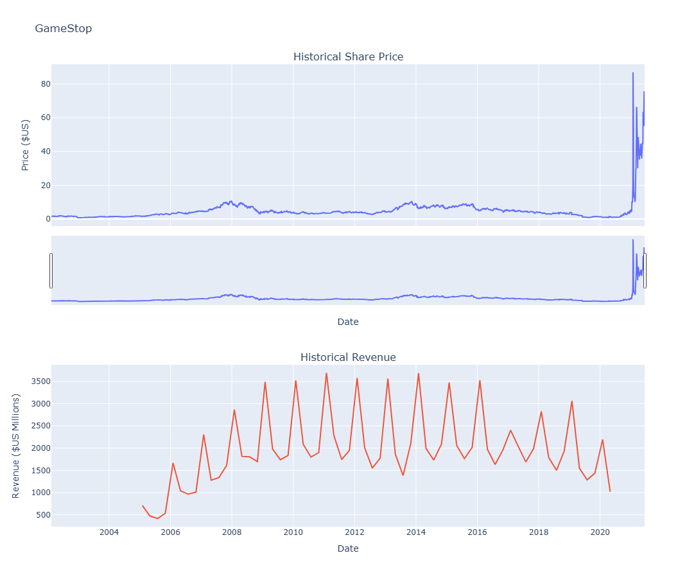

# 📈 Tesla & GameStop Stock and Revenue Analysis

This project analyzes and visualizes historical stock price and quarterly revenue data for **Tesla (TSLA)** and **GameStop (GME)** using Python.

It combines data extraction from APIs and web scraping with data cleaning and visualization.

---

## 🛠 Technologies Used

- `yfinance` – for pulling historical stock price data
- `requests` + `BeautifulSoup` – for scraping revenue data from HTML
- `pandas` – for data manipulation
- `plotly` – for interactive visualizations
- `Jupyter Notebook` – for writing and presenting the analysis

---

## 📊 Features

- ✅ Extracts Tesla and GameStop stock data using `yfinance`
- ✅ Scrapes revenue data from online HTML tables
- ✅ Cleans and prepares financial data for analysis
- ✅ Creates interactive graphs with subplots:
  - Historical Share Price
  - Quarterly Revenue
- ✅ Reusable `make_graph()` function for visualization

---

## 📎 Example Output

The notebook includes side-by-side interactive graphs showing:

- 📉 Share price trends
- 💵 Quarterly revenue over time

> _Note: Data is limited to June 2021 for consistency with the project scope._

---

## 📁 Project Structure
```
├──.gitignore
├── README.md
├── gamestop.png
├── tesla.png
└── tesla_gamestop_stock_analysis.ipynb
```

## 📸 Graph Snapshots

### Tesla


### GameStop

